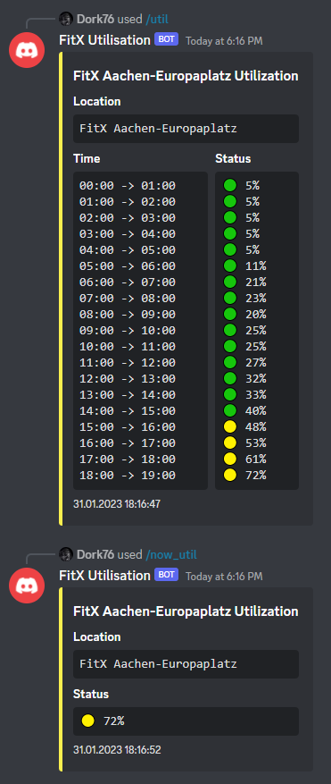

# FitX-Utilization-Bot

This discord bot will show you the current utilization of your gym.
You will need your FitX login credentials to use their API.

Original credits go to github.com/nabil-ak who created this bot for McFit utilization.

## Installation

Use the package manager [pip](https://pip.pypa.io/en/stable/) to install the requirement frameworks.

```bash
pip install -r requirements.txt
```
## Settings
1. Change the ```EMAIL```, ```PASSWORD``` to your **login credentials**
2. Set the right ```ID``` of your GYM. The ID is behind the studio in the url of the gym (https://mein.fitx.de/studio/ **Zml0eDoxNTI0NTE0MDcw**)
3. Create and set the ```token``` of your discord bot.

```env
EMAIL = ENTER_EMAIL
PASSWORD = ENTER_PASSWORD
STUDIO = THE_ID_OF_YOUR_STUDIO
DISCORD_BOT_TOKEN = THE_TOKEN_OF_YOUR_DISCORD_BOT
```
## Usage
1. Create a token for your discord bot in the discord developer dashboard.
2. Change your .env file with your own data.
3. Run the bot with ```python3 bot.py```.
4. Use the ```/util```command to get the current utilization of your gym.

## Example


## License
[MIT](https://choosealicense.com/licenses/mit/)